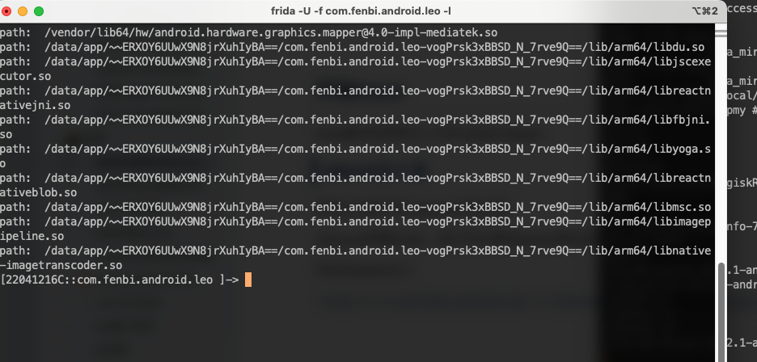
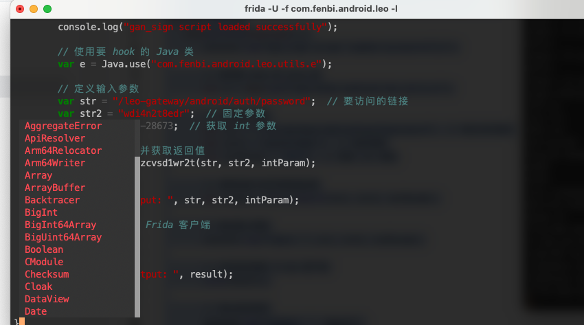
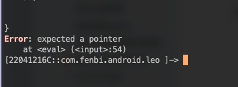
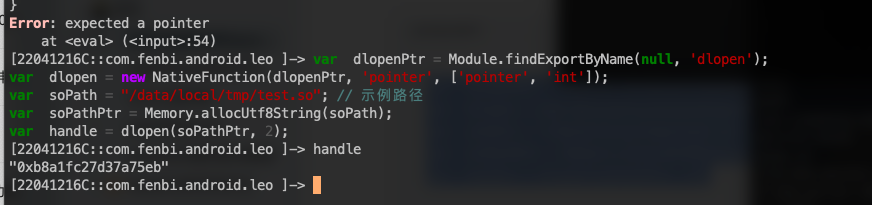
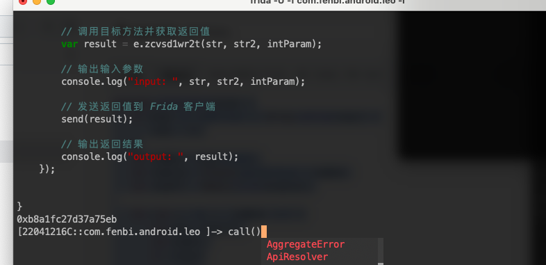
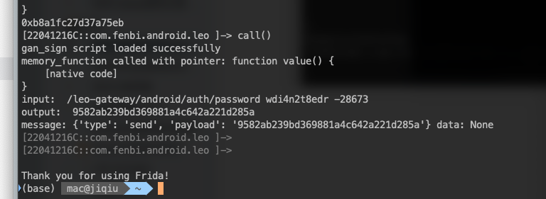
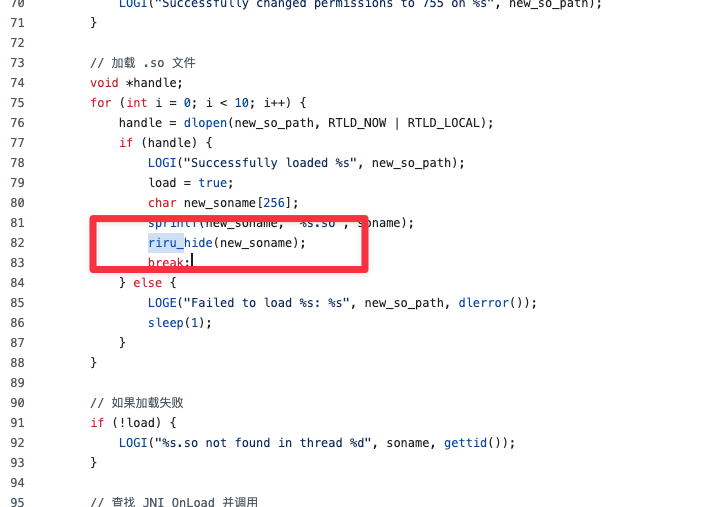

# 如何开始我们的trace之旅

demo测试包已经发布,在demo文件夹下 有配套的js和apk包

tracehelp.zip是辅助的面具模块，一定要刷入

test.so是trace的本体

‍

‍

# 注意事项

本trace目前仅支持了arm64架构，在一些老的机型上走的是arm32，是无法trace的，后面会优先支持

如果本仓库🌟破了800，将会开启ios版本的trace开发，不会食言

‍

‍

# 从零开始使用这个trace

## 前戏准备

这一步顾名思义就是准备环境

首先你要有一台系统在安卓14以下的设备，群友实测安卓14不可以

第二步刷入面具模块（支持Magisk，Kernelsu、Aptach）等各种，可以解包看一下原理，没干啥东西

第三步关闭 selinux

```bash
adb shell
su
setenforce 0
```

第四步推送test.so到/data/local/tmp

‍

‍

## 开始trace

trace脚本有两种注入方法 attach/spwan

### attach注入法

首先以文章中的xiaoyuan来做讲解 第一篇文章在此
https://bbs.kanxue.com/thread-283960.htm 
xiaoyuan带着msao（见文章），我们可以使用spwan使用过掉msao的脚本

然后在attach注入

​`frida -U -f com.fenbi.android.leo -l /Users/mac/Documents/androidtools/bypassmsao.js`​

‍

​​

在这个状态下粘贴demo/xiaoyuan/xiaoyuan.js进到shell里

​​

然后按回车就可以了

‍

如果遇到了这个报错

​​

首先你需要检查是否setenfore 0这个命令是否运行，因为selinux不关闭无法注入/data/local/tmp目录下的东西

第二要检查你是否把so移动到合适的位置

至于为什么是data/local/tmp 因为所有app都对这个目录有可读权限

```javascript
var  dlopenPtr = Module.findExportByName(null, 'dlopen');
var  dlopen = new NativeFunction(dlopenPtr, 'pointer', ['pointer', 'int']);
var  soPath = "/data/local/tmp/test.so"; // 示例路径
var  soPathPtr = Memory.allocUtf8String(soPath);
var  handle = dlopen(soPathPtr, 2);
```

你可以在这里找到注入逻辑手动注入so到app进程中

​​

如果正常注入的话，你可以通过输入handle拿到注入so的数值

‍

在一切注入无误后 我们可以主动调用

​​

‍

在出现结果以后建议立马按ctrl+D 退出

​​

‍

为什么要退出？ 因为其他接口也会调用到这个函数逻辑里，如果不退出可能会出现log.log的内容和你frida打印不一致的情况

就没有什么别的好方法了吗？ 有，让我们来看spwan注入方法

‍

### spwan注入方法 感谢D_Z66666大佬帮忙共同完成

这个脚本是trace某宝的

```javascript
function prepareArgs(args) {
    if (args === undefined || !Array.isArray(args)) {
        args = [];
    }
    var argNum = args.length;
    var argSize = Process.pointerSize * argNum;
    var argsPtr = Memory.alloc(argSize);

    for (var i = 0; i < argNum; i++) {
        var arg = args[i];
        var argPtr;
        if (!arg) {
            arg = 0
        }
        if (arg instanceof NativePointer) {
            // 如果是 NativePointer，直接使用
            argPtr = arg;
        } else if (typeof arg === 'number') {
            // 如果是数字，直接转换为指针
            argPtr = ptr(arg);
        } else if (typeof arg === 'string') {
            // 如果是字符串，分配内存并获取指针
            argPtr = Memory.allocUtf8String(arg);
        } else if (typeof arg === 'object' && arg.hasOwnProperty('handle')) {
            // 如果是带有 handle 属性的对象（如 JNIEnv）
            argPtr = arg.handle;
        } else if (typeof arg === 'object' && arg instanceof ArrayBuffer) {
            // 如果是二进制数据，分配内存并写入数据
            var dataPtr = Memory.alloc(arg.byteLength);
            Memory.writeByteArray(dataPtr, arg);
            argPtr = dataPtr;
        } else {
            console.error('Unsupported argument type at index ' + i + ':', typeof arg);
            throw new TypeError('Unsupported argument type at index ' + i + ': ' + typeof arg);
        }

        // 将参数指针写入参数数组
        Memory.writePointer(argsPtr.add(i * Process.pointerSize), argPtr);
    }

    return {
        argsPtr: argsPtr,
        argNum: argNum
    };
}

var vmtraceAddr;
var vmtrace;


function hook_sub_1329B0() {
    var aimbase =Module.findBaseAddress("libsgmainso-6.6.231204.so");
    console.log("start hook");
    var targetFuncAddr = aimbase.add(0x1329B0);
    Interceptor.replace(targetFuncAddr, new NativeCallback(function (arg0,arg1,arg2,arg3,arg4,arg5) {
        console.log("trace调用了");
        Interceptor.revert(targetFuncAddr);
        Interceptor.flush();
        var args =[arg0,arg1,arg2,arg3,arg4,arg5];
        var {argsPtr, argNum} = prepareArgs(args);
        var argPtr1 = Memory.allocUtf8String("/data/user/0/com.taobao.taobao/log.txt");
        var res =vmtrace(targetFuncAddr, argsPtr,argNum,argPtr1,0);
        console.log(res)
        return res;
    }, 'pointer', ['pointer','pointer','pointer','pointer','pointer','pointer']));
}

function hook_soload() {
    var  dlopenPtr = Module.findExportByName(null, 'dlopen');
    var  dlopen = new NativeFunction(dlopenPtr, 'pointer', ['pointer', 'int']);
    var soPath = "/data/local/tmp/test.so"; // 示例路径
    var  soPathPtr = Memory.allocUtf8String(soPath);
    var handle = dlopen(soPathPtr, 2);
    console.log(handle);
    vmtraceAddr = Module.findExportByName("test.so", 'vm_call');
    vmtrace = new NativeFunction(vmtraceAddr, 'pointer', ['pointer', 'pointer', 'uint32', 'pointer', 'uint32']);

    var isinit = 0;
    var dlopen_addr = Module.findExportByName(null, "android_dlopen_ext");
    var find = 0;
    console.log("android_dlopen_ext: ", dlopen_addr);
    Interceptor.attach(dlopen_addr, {
        onEnter: function (args) {
            var addr = args[0];
            var str = ptr(addr).readCString();
            this.name = str;

            if (str.indexOf("libsgmainso-6.6.231204.so") >= 0) {
                console.log("dlopen==> " + (str));
                find = 1;
            } else {
                find = 0;
            }
        },
        onLeave: function (retval) {
            if (find > 0) {
                if (isinit == 0) {
                    hook_sub_1329B0();
                    isinit = 1;
                }

            }
        }
    })


}
setImmediate(hook_soload)
```

我来带大家简单读一下这个脚本，

hook了so加载的地方，当目标so加载完成的时候开始hook，但是如果你想hook init函数段则需要更改时机

```javascript
Interceptor.revert(targetFuncAddr);
Interceptor.flush();
```

这两句代码保证被替换的函数只被替换一次后就被还原，保证你的trace只走一次，只生成一份log

防止一个高频调用的函数一直处于trace状态，导致trace文件被覆盖

注意 new NativeCallback(function (arg0,arg1,arg2,arg3,arg4,arg5)

参数的个数需要根据函数的签名填写，如果填写多了/少了就可能造成崩溃，所以最重要的是确定好要传入的参数

‍

# 常见问题

‍

## 我是否可以使用其他方法注入？

答：可以 xposed 还有zygisk等支持

也可以使用我的项目：

https://github.com/jiqiu2022/Zygisk-MyInjector/blob/main/module/src/main/cpp/hack.cpp

我在早期都是使用这个项目注入的

但是需要注释掉

​​

因为隐藏了以后就找不到了\

如果你使用非frida注入，可以无视掉每次开机的关闭selinux流程

‍

## Error: expected a pointer

​​

首先你需要检查是否setenfore 0这个命令是否运行，因为selinux不关闭无法注入/data/local/tmp目录下的东西

第二要检查你是否把so移动到合适的位置

至于为什么是data/local/tmp 因为所有app都对这个目录有可读权限

‍

## [debug] Failed to open /proc/self/mem

​​

检查系统是否在安卓14以下

检查面具模块是否刷入

‍

## Error :access violation accessing 0x0

​​

检查参数数量等是否传入正确

注意：最新版本中 openStrLog 已固定为 6，不再需要作为参数传入。现在最后一个参数是 windowSize，用于控制内存扫描窗口大小，默认值为 0x100

‍

## 参数一定要正确

感谢群友提供的图 ！

​​

## 最新版本更新说明（2025-05-05）

1. `openStrLog` 参数已固定为 6，不再需要作为参数传入
2. 新增 `windowSize` 参数，用于控制内存扫描窗口大小，默认值为 0x100
3. 优化了寄存器值变化的格式化输出，使其更易于搜索和分析

### 新版本 vm_call 函数签名

```c
extern "C" rword vm_call(void *addr, QBDI::rword *args, uint32_t argNum, char *logpath, size_t windowSize = 0x100)
```

### windowSize 参数说明

`windowSize` 参数控制内存扫描时的窗口大小，较大的值会扫描更多内存区域，可能发现更多字符串，但也会增加扫描时间和日志大小。

- 默认值：0x100（256字节）
- 推荐值范围：0x100 - 0x1000
- 对于需要扫描更大内存区域的场景，可以设置更大的值，如 0x200 或 0x400
